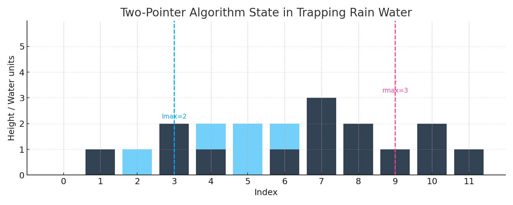

# Water Tank – Trapping Rain Water

An interactive, zero-dependency web app that visualizes the classic Trapping Rain Water problem. Enter bar heights, render an SVG chart of blocks and trapped water, and see computed stats in real time. The core solution uses the two-pointer algorithm with O(n) time and O(1) extra space.

## Demo (Local)
You can run this locally without any build tools.

### Option 1: Open directly
1. Double-click `index.html` to open it in your browser.

### Option 2: Serve over HTTP (recommended)
Some browsers restrict local file access. Use a lightweight static server:

- Python 3:
  ```bash
  python3 -m http.server 8000
  ```
  Open http://localhost:8000 in your browser and navigate to `water-tank-visualizer/`.
  


## Features
- Input parsing for comma- or space-separated bar heights
- SVG visualization of bars (blocks) and trapped water
- Live stats: total water units, number of bars, and maximum bar height
- Randomize button for quick test generation
- Responsive layout with scalable SVG and simple, accessible color legend
- Algorithm: two-pointer method (left/right maxima) with linear time and constant space

## How It Works
- You provide an array of non-negative integers representing bar heights.
- The app computes, for each index, the water level constrained by the tallest bar to the left and right.
- Trapped water at index i = max(min(maxLeft[i], maxRight[i]) - height[i], 0).
- The two-pointer method avoids storing full prefix/suffix arrays, instead maintaining running maxima from both ends and accumulating water on the fly.

### Algorithm Outline (Two-Pointer)
1. Initialize `left = 0`, `right = n - 1`, `left_max = 0`, `right_max = 0`, `water = 0`.
2. While `left < right`:
   - If `height[left] <= height[right]`:
     - If `height[left] >= left_max`: update `left_max`.
     - Else: add `left_max - height[left]` to `water`.
     - Move `left` right.
   - Else (right side is the limiting edge):
     - If `height[right] >= right_max`: update `right_max`.
     - Else: add `right_max - height[right]` to `water`.
     - Move `right` left.
3. Result is `water`.

## Usage
1. Open the app.
2. In the input box, enter heights, e.g.:
   - `0,1,0,2,1,0,1,3,2,1,2,1` or `0 1 0 2 1 0 1 3 2 1 2 1`
3. Click **Render** to visualize.
4. Optionally click **Randomize** to generate a sample case.
5. Read the stats panel for total water and other metrics.

## Input Format
- Accepts integers separated by commas and/or whitespace.
- Non-integer tokens are ignored or coerced if possible; invalid overall input results in an empty or partial render depending on parsing.
- Negative values are treated as 0 height for visualization purposes (if present).

## Project Structure
- `index.html` — App shell and layout
- `style.css` — Styling, layout, and color legend
- `script.js` — Input parsing, algorithm, SVG rendering, and stats updates
- `assets/` — Images or additional resources (if any)

## Development Notes
- No build step; plain HTML/CSS/JS.
- Works in modern browsers (Chrome, Edge, Firefox, Safari).
- SVG scales with the viewport using `viewBox` and `preserveAspectRatio`.

## Accessibility
- Clear visual distinction between bars and water via color and legend.
- Text alternatives for stats.
- Keyboard operation for buttons and input.

## Performance
- Algorithm is O(n) time, O(1) extra space.
- SVG rendering is efficient for typical input sizes (hundreds of bars). Extremely large arrays may impact performance due to DOM size.

## Troubleshooting
- Nothing renders:
  - Ensure the input is valid integers separated by commas/spaces.
  - Try serving via HTTP to avoid local file restrictions (see Demo section).
- Water values look wrong:
  - Verify there are no negative heights and values are integers.
- Layout issues:
  - Try resizing the browser window or zoom level; SVG is responsive.

## Extending
- Add presets for common test cases.
- Export the chart as PNG/SVG.
- Animate per-step fill to illustrate the two-pointer sweep.
- Add unit tests for the algorithm in a separate JS test runner.

## License
This project is licensed under the terms of the LICENSE file included in the repository.